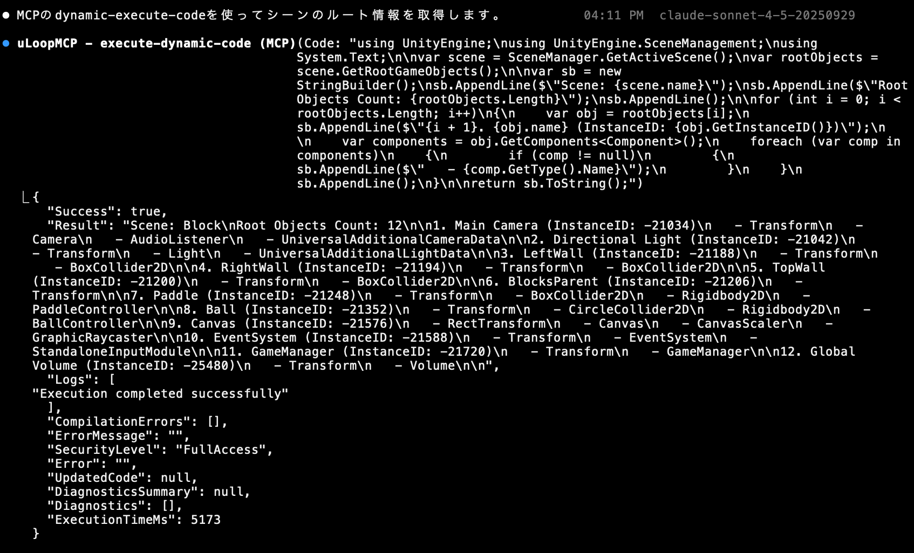

<!-- _class: title -->
# Unityにおける<br>AIエージェント活用術
開発現場での試行錯誤を共有

---
<!-- _class: content -->
# 目次

1. **自己紹介**
2. **業界動向と最新トピック（CEDEC/Next Tokyo）**
3. **AIで簡単にゲーム開発できる？**
4. **Unityの課題とAI活用ポイント**
5. **仕様書駆動×AI（要件入力〜仕様生成）**
6. **カスタムコマンドと調査基盤**
7. **UnityMCPによる連携と動的実行（デモ）**
8. **共有**
9. **まとめ**

---

<!-- _class: content -->
# 自己紹介

<div class="flex sb">
<div>


</div>
<div>

## 今井駿汰
- 株式会社QualiArts
- テクニカルアーティスト
</div>
</div>


<div class="flex sb">
<div>

</div>
</div>

---
<!-- _class: section num-1-->
# ゲーム業界でのAI活用

---
<!-- _class: content -->
# ゲーム業界のAI活用が急激に進んでいる

## **CEDEC2025** 
- バグチケット起票の自動化
- セリフ→モーションの推定
- 画像・音声認識＋OCR/特徴点サンプリングでゲームの自動テスト
- AIを使って仕様書の自動作成・アップデート

## **Google Cloud Next Tokyo**
- 1日目の基調講演全てがAI関連

<!-- CESAのアンケートの話題を入れてもいいかも -->

---
<!-- _class: section num-2-->
# AIで簡単にゲーム開発できるようになる？

---
<!-- _class: content -->
# デモ録画：ブロック崩し作成プロセス
## **指示: ブラウザで動くブロック崩しを作って**


<video controls width="700px">
  <source src="resources/block.mp4" type="video/mp4">
</video>


---
<!-- _class: content -->
# 生成されたコードの抜粋

```javascript
(function(){
// ===== Canvas & Pixel Ratio =====
const BASE_W = 800, BASE_H = 600; // ゲーム座標系
const canvas = document.getElementById('game');
const ctx = canvas.getContext('2d');


function setupCanvas() {
const dpr = Math.max(1, Math.min(2.5, window.devicePixelRatio || 1));
canvas.width = Math.round(BASE_W * dpr);
canvas.height = Math.round(BASE_H * dpr);
canvas.style.aspectRatio = `${BASE_W}/${BASE_H}`;
ctx.setTransform(dpr, 0, 0, dpr, 0, 0); // 論理座標=CSSピクセル
}
setupCanvas();
window.addEventListener('resize', setupCanvas);


// ===== Game State =====
const state = {
running: false,
paused: false,
score: 0,
level: 1,
lives: 3,
highScore: Number(localStorage.getItem('breakout.highscore')||0),
};


// HUD refs
const scoreEl = document.getElementById('score');
const levelEl = document.getElementById('level');
const livesEl = document.getElementById('lives');
const pauseBtn = document.getElementById('pauseBtn');// AIが生成したコードの例（一部抜粋）
```

<!-- スクリーンショット必要：生成された完全なコードの画面 -->

<div class="highlight-box">
JavascriptとCanvas APIを使って作成される
</div>

---
<!-- _class: content -->
# Unityでも挑戦
## **指示: ブロック崩しを作って**
* **壊れた**metaファイル
* **壊れた**Prefab
* **壊れた**Scene
* **コンパイルの通らない**コード

---
<!-- _class: content -->
# Unityでも挑戦
## **指示: ブロック崩しを作って**
- **壊れた**metaファイル
- **壊れた**Prefab
- **壊れた**Scene
- **コンパイルの通らない**コード

<div class="highlight-box">
全然ダメそう🫠
</div>


---
<!-- _class: content -->
# Unityでは課題がある

## ゲーム開発特有の複雑さ
- **アセット管理**：画像、音声、3Dモデルの複雑な依存関係
- **Prefab作成**： UnityAPIを経由しないと作成が困難
- **シーン構築**：オブジェクト配置の3D空間理解が困難
- **シリアライズ**：Unityの独特なデータ構造
- **ライブラリ**：様々なライブラリの使用方法

<div class="highlight-box">
UnityでゲームをAIに作ってもらうのは難しい
</div>

---
<!-- _class: content -->
# 一部のタスクをAIに任せることは可能
- コードの一部を編集
- リファクタリング
- 指示を具体的にして実行する

---
<!-- _class: content -->
# 一部のタスクをAIに任せることは可能
- コードの一部を編集
- リファクタリング
- **指示を具体的にして実行する**

---
<!-- _class: content -->
# 指示を具体的にする
## **指示を具体的に書けばAIは追従してくれる**
```
- インスタンスのライフサイクルはGameObjectに紐付いて
- HogeManagerが以下のプロパティ・メソッドを持ち
  - HogeProperty
  - HogeMethod
  - FugaMethod
- HogeClientがHogeManagerを使用して、HogeMethodを呼び出す
- HogeClientは以下の要素をシリアライズして...
- 変数の命名規則は...
- 関数の命名規則は...
- イベントはHogeEventとして定義して...
- 非同期処理にはUniTaskを使い、CancellationTookenはGameObjectから取得して..
```
<div class="highlight-box">
具体的な指示→精度よく自走<br>
仕様書レベルまで詳細な指示ができればAIは自走してくれる
</div>


---
<!-- _class: section num-3-->
# Unityにおける<br>仕様書駆動開発

---
<!-- _class: content -->
# 最近流行りの仕様書開発駆動
<!-- 中央寄せしたい -->
<div class="img-center">
  
</div>
<div class="highlight-box">
要件定義(仕様書)を作ってからコーディングを開始することで実装精度が上がる
</div>

---
<!-- _class: content -->
# これもUnityで使うには課題がある
<div class="img-center">

</div>

<div class="highlight-box">
Unityに最適化した仕様書の作成フォーマットが必要
</div>


---
<!-- _class: content -->
# Unity用の仕様書作成コマンドを考える
## **エンジニアが把握している知識**
- プロジェクト全体のアーキテクチャ
- 使用しているフレームワーク
- ライブラリの使用パターン
- コーディング規約

## **実装する際は**
- 既存実装の把握
- 依存する機能の把握
- コーディングルールの把握


---
<!-- _class: content -->
# 作りたいものの入力


<div class="highlight-box">
作りたいものと要件を入力する
</div>

---
<!-- _class: content -->
# 仕様書作成のセットアップ


---
<!-- _class: content -->
# AIの自律調査


---
<!-- _class: content -->
# 方向性の質問


---
<!-- _class: content -->
# ユーザーの回答


<div class="highlight-box">
AIの方針を確認・軌道修正
</div>

---
<!-- _class: content -->
# 追加調査


---
<!-- _class: content -->
# エキスパート質問


---
<!-- _class: content -->
# 完了


---
<!-- _class: content -->
# 生成された仕様書


<div class="img-center">
<video controls width="600px">
  <source src="resources/requirements_movie.mp4" type="video/mp4">
</video>
</div>


<div class="highlight-box">
この仕様書をもとに実装する
</div>

---
<!-- _class: content -->
# 作ったもの
<!-- Snakeゲームも書く -->
<!-- ブロック崩しも書く -->

<div class="flex sb">
<div>
<video controls width="500px">
  <source src="resources/motion.mp4" type="video/mp4">
</video>
</div>
<div>
<video controls width="500px">
  <source src="resources/particle.mp4" type="video/mp4">
</video>
</div>
</div>

---
<!-- _class: content -->
# カスタムコマンドの流れ
1. ユーザー要求の理解
2. ユーザー要求をもとにコードを探索
3. 探索したコードをもとにユーザーに質問
4. ユーザーの回答をもとに追加探索
5. 追加探索結果をもとにユーザーに再度質問
6. 仕様書の作成


---
<!-- _class: content -->
# カスタムコマンド抜粋
```xml
     <phase id="1" name="初期セットアップと依存関係把握">
       <purpose>
         プロジェクト環境の準備とユーザーが言及した要素の依存関係を把握
       </purpose>
       <steps>
         <step id="1-1" name="環境セットアップ">
           <actions>
             - タイムスタンプベースのフォルダを作成: requirements/YYYY-MM-DD-HHMM-[slug]
             - $ARGUMENTSからスラグを抽出 (例: "ユーザープロフィールを追加" → "user-profile")
             - 初期ファイルを作成:
               - 00-initial-request.md にユーザーのリクエストを記録
               - metadata.json にステータス追跡情報を記録
             - requirements/.current-requirement をフォルダ名で更新
           </actions>
         </step>
      </phase>
      <phase id="2" name="コンテキスト発見質問">
      <steps>
        <step>
          問題空間を理解するための最も重要な5つのyes/no質問を生成:
          - コードベース構造に基づいた質問
          - ユーザーインタラクションとワークフローに関する質問
          - ユーザーが現在使用している類似機能に関する質問
          - 扱うデータ/コンテンツに関する質問
          - 外部統合やサードパーティサービスに関する質問
          - パフォーマンスやスケールの期待に関する質問
          - すべての質問をスマートデフォルト付きで 01-discovery-questions.md に記録
          - スマートデフォルトオプションを提案しながら、5つまとめて質問
          - すべての質問が回答された時にのみ、受け取った回答を 02-discovery-answers.md に記録し、metadata.json を更新
        </step>
      </steps>
    </phase>
```

<div class="highlight-box">
900行のXMLファイル
</div>


---
<!-- _class: content -->
# 呼び出すメソッドのシグネチャを検証

```xml
<investigation id="1">
  **依存クラスの詳細調査**
  - Phase 1で特定した依存クラスの完全な理解
  - メソッドシグネチャ、プロパティ、使用パターン
  - 実装例と注意点
</investigation>

<investigation id="2">
  **API調査と実装パターン検証**
  - 実際のソースコードからメソッドシグネチャを完全理解
  - パラメータ型、戻り値型、例外を含む正確な情報
  - 存在が不確かなメソッドの検証
</investigation>
```

---
<!-- _class: content -->
# 呼び出すメソッドのシグネチャを検証


---
<!-- _class: content -->
# UnityのEditor側ソースコードも参照する
UnityはEditor側のソースコードが公開され参照用に使用することができる


---
<!-- _class: content -->
# UnityのEditor側ソースコードも参照する
UnityCsReferenceをサブモジュールに設定して参照

```xml
  <investigation id="10" agent="unity-reference-researcher">
    **Unity内部実装の調査**（必要に応じて）
    - Unity固有APIの詳細
    - パフォーマンス考慮事項
    - Unity推奨パターン
  </investigation>
```

<br>

<div class="highlight-box">
仕様書の精度が大幅に向上<br>
UnityのAPIも間違えずに呼び出してくれる
</div>

---
<!-- _class: content -->
# サブエージェントの活用
- UnityのEditorReferenceを参照するエージェント
- 調査専用のエージェント
- 

---
<!-- _class: content -->
# ここまででEditor拡張は作成可能
<div class="flex sb">
<div>
<video controls width="500px">
  <source src="resources/motion.mp4" type="video/mp4">
</video>
</div>
<div>
<video controls width="500px">
  <source src="resources/particle.mp4" type="video/mp4">
</video>
</div>
</div>


---
<!-- _class: content -->
# 残りの課題
<!-- 中央寄せしたい -->


---
<!-- _class: section num-3-->
# UnityMCPの活用

---
<!-- _class: content -->
# AIとUnityの連携

## **MCPサーバーの活用**
- コンパイルの実行
- Prefab・シーンの操作
- Unityの実行


<div class="highlight-box">
uLoop MCPを使用
</div>


---
<!-- _class: content -->
# 簡単なゲームまで作成可能

<div class="highlight-box">
コンパイルの実行とコンパイルエラーの修正を自律的に行えるように
</div>
<div class="img-center">
<video controls width="700px">
  <source src="resources/snake_game.mp4" type="video/mp4">
</video>
</div>

---
<!-- _class: content -->
# さらなる活用
- Prefab情報取得
- Scene情報取得
- Scene編集
  - 名前変更
  - パラメーター変更
  - 参照追加
  - オブジェクト追加
  - オブジェクト削除
- Prefab編集
  - 名前変更
  .......


---
<!-- _class: content -->
# コードをAIに書かせて実行させる
## AIにUnity APIを呼び出すコードを書かせて実行させる
```csharp
            public static void SpawnPrefab()
            {
                string[] guids = AssetDatabase.FindAssets("prefab t:Prefab");
                string path = AssetDatabase.GUIDToAssetPath(guids[0]);
                var prefab = AssetDatabase.LoadAssetAtPath<GameObject>(path);

                GameObject go = Object.Instantiate(prefab);
                go.AddComponent<HogeComponent>();
            }

```

<div class="highlight-box">
コードを実行すればできることは無限大に広がる
</div>

---
<!-- _class: content -->
# コードの動的実行
コードを作成
↓
コンパイル
↓
実行
## **これは効率がわるい**


<div class="highlight-box">
コードを動的実行する機能が<br>MCPに存在
</div>


---
# 2つのMCPに搭載
<!-- _class: content -->


<div class="highlight-box">
動的なコード実行をサポート
</div>


---
# コードの動的実行
<!-- _class: content -->


---
<!-- _class: content -->
# コードの動的実行

<div class="img-center">
  
</div>

<div class="highlight-box">
Unity APIを呼び出すことで解決
</div>

---
<!-- _class: content -->
# 完成

<div class="img-center">
<video controls width="800px">
  <source src="resources/blockbaster.mp4" type="video/mp4">
</video>
</div>

<div class="highlight-box">
アセット管理・Prefab作成・シーン構築・シリアライズまでAIが対応
</div>


---
<!-- _class: content -->
# 共有

https://github.com/rarudo/UnityAIAgentWorkflowSample


---
<!-- _class: content -->
# まとめ
## **UnityでAIエージェントを最大限活用するためには**
- 仕様書から書かせる
- 仕様書の時点で実装の方向性をすり合わせる
- ライブラリ・UnityのC#実装を参照させる
- Unityの操作はMCPを使用する
- 動的コード実行でUnityアセットのコンテキストを収集する

<div class="highlight-box">
まだまだ発展途中<br>指示の仕方や与えるツールによりより精度が上がる可能性がある
</div>

---
<!-- _class: title -->
# ご清聴ありがとうございました
